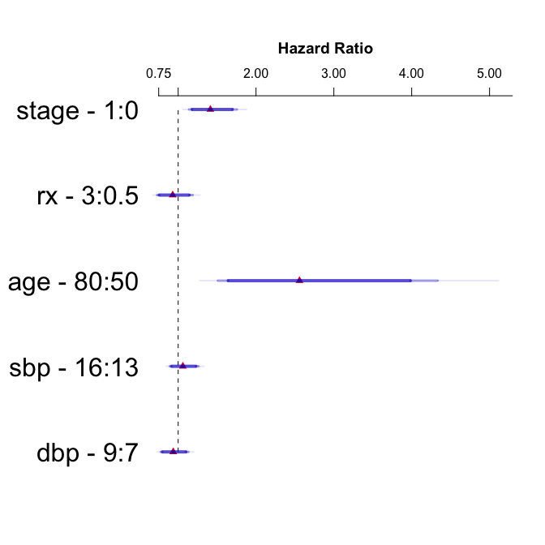

# Example survival analysis using broom, rms and survminer
By: Vijay Ivaturi, `@vijay_ivaturi`, vivaturi at rx dot umaryland dot edu  
`r format(Sys.time(), '%d %B, %Y')`  


# Setting up example dataset


```r
library(rms)
```

```
## Loading required package: Hmisc
```

```
## Loading required package: lattice
```

```
## Loading required package: survival
```

```
## Loading required package: Formula
```

```
## Loading required package: ggplot2
```

```
## 
## Attaching package: 'Hmisc'
```

```
## The following objects are masked from 'package:base':
## 
##     format.pval, round.POSIXt, trunc.POSIXt, units
```

```
## Loading required package: SparseM
```

```
## 
## Attaching package: 'SparseM'
```

```
## The following object is masked from 'package:base':
## 
##     backsolve
```

```r
library(Hmisc)
library(tidyverse)
```

```
## Loading tidyverse: tibble
## Loading tidyverse: tidyr
## Loading tidyverse: readr
## Loading tidyverse: purrr
## Loading tidyverse: dplyr
```

```
## Conflicts with tidy packages ----------------------------------------------
```

```
## combine():   dplyr, Hmisc
## filter():    dplyr, stats
## lag():       dplyr, stats
## src():       dplyr, Hmisc
## summarize(): dplyr, Hmisc
```

```r
library(readxl)
library(dplyr)
library(tidyr)
library(tableone)
library(survminer)
```

```
## Loading required package: ggpubr
```

```
## 
## Attaching package: 'survminer'
```

```
## The following object is masked from 'package:ggpubr':
## 
##     theme_classic2
```

```
## The following object is masked from 'package:ggplot2':
## 
##     %+%
```

```r
library(broom)
rep_na <- function(x){
  ifelse(is.na(x), -99, x)
}
```


```r
#loading the prostate dataset from the rms book
#load(url('http://biostat.mc.vanderbilt.edu/wiki/pub/Main/DataSets/prostate.sav'))
#write.csv(prostate,"../data/derived/prostate.csv", row.names = FALSE)
df <- read.csv("../data/pr.csv", header = TRUE)
```

Data summary


```r
d <- describe(df[2:17])
html(d)
```

<!--html_preserve--><meta http-equiv="Content-Type" content="text/html; charset=utf-8" /> 
<script type="text/javascript">
<!--
    function expand_collapse(id) {
       var e = document.getElementById(id);
       var f = document.getElementById(id+"_earrows");
       if(e.style.display == 'none'){
          e.style.display = 'block';
          f.innerHTML = '&#9650';
       }
       else {
          e.style.display = 'none';
          f.innerHTML = '&#9660';
       }
    }
//-->
</script>
<style>
.earrows {color:silver;font-size:11px;}

fcap {
 font-family: Verdana;
 font-size: 12px;
 color: MidnightBlue
 }

smg {
 font-family: Verdana;
 font-size: 10px;
 color: &#808080;
}

hr.thinhr { margin-top: 0.15em; margin-bottom: 0.15em; }

span.xscript {
position: relative;
}
span.xscript sub {
position: absolute;
left: 0.1em;
bottom: -1ex;
}
</style>
 <font color="MidnightBlue"><div align=center><span style="font-weight:bold">df[2:17] <br><br> 16  Variables &#8195; 475  Observations</span></div></font> <hr class="thinhr"> <span style="font-weight:bold">stage</span> <style>
 .hmisctable800487 {
 border: none;
 font-size: 85%;
 }
 .hmisctable800487 td {
 text-align: center;
 padding: 0 1ex 0 1ex;
 }
 .hmisctable800487 th {
 color: MidnightBlue;
 text-align: center;
 padding: 0 1ex 0 1ex;
 font-weight: normal;
 }
 </style>
 <table class="hmisctable800487">
 <tr><th>n</th><th>missing</th><th>distinct</th><th>Info</th><th>Sum</th><th>Mean</th><th>Gmd</th></tr>
 <tr><td>475</td><td>0</td><td>2</td><td>0.733</td><td>202</td><td>0.4253</td><td>0.4899</td></tr>
 </table>
 <hr class="thinhr"> <span style="font-weight:bold">rx</span><div style='float: right; text-align: right;'></div> <style>
 .hmisctable208591 {
 border: none;
 font-size: 85%;
 }
 .hmisctable208591 td {
 text-align: center;
 padding: 0 1ex 0 1ex;
 }
 .hmisctable208591 th {
 color: MidnightBlue;
 text-align: center;
 padding: 0 1ex 0 1ex;
 font-weight: normal;
 }
 </style>
 <table class="hmisctable208591">
 <tr><th>n</th><th>missing</th><th>distinct</th><th>Info</th><th>Mean</th><th>Gmd</th></tr>
 <tr><td>475</td><td>0</td><td>4</td><td>0.937</td><td>1.505</td><td>1.258</td></tr>
 </table>
 <pre style="font-size:85%;">
 Value          0     1     2     3
 Frequency    119   118   117   121
 Proportion 0.251 0.248 0.246 0.255
 </pre>
 <hr class="thinhr"> <span style="font-weight:bold">dtime</span><div style='float: right; text-align: right;'></div> <style>
 .hmisctable545012 {
 border: none;
 font-size: 85%;
 }
 .hmisctable545012 td {
 text-align: center;
 padding: 0 1ex 0 1ex;
 }
 .hmisctable545012 th {
 color: MidnightBlue;
 text-align: center;
 padding: 0 1ex 0 1ex;
 font-weight: normal;
 }
 </style>
 <table class="hmisctable545012">
 <tr><th>n</th><th>missing</th><th>distinct</th><th>Info</th><th>Mean</th><th>Gmd</th><th>.05</th><th>.10</th><th>.25</th><th>.50</th><th>.75</th><th>.90</th><th>.95</th></tr>
 <tr><td>475</td><td>0</td><td>76</td><td>1</td><td>35.79</td><td>26.73</td><td> 1.7</td><td> 5.0</td><td>14.0</td><td>33.0</td><td>57.0</td><td>67.0</td><td>70.3</td></tr>
 </table>
 <span style="font-size: 85%;"><font color="MidnightBlue">lowest</font>&#160;:  0  1  2  3  4 ,  <font color="MidnightBlue">highest</font>: 72 73 74 75 76</span> <hr class="thinhr"> <span style="font-weight:bold">status</span> <style>
 .hmisctable261893 {
 border: none;
 font-size: 85%;
 }
 .hmisctable261893 td {
 text-align: center;
 padding: 0 1ex 0 1ex;
 }
 .hmisctable261893 th {
 color: MidnightBlue;
 text-align: center;
 padding: 0 1ex 0 1ex;
 font-weight: normal;
 }
 </style>
 <table class="hmisctable261893">
 <tr><th>n</th><th>missing</th><th>distinct</th><th>Info</th><th>Sum</th><th>Mean</th><th>Gmd</th></tr>
 <tr><td>475</td><td>0</td><td>2</td><td>0.616</td><td>338</td><td>0.7116</td><td>0.4113</td></tr>
 </table>
 <hr class="thinhr"> <span style="font-weight:bold">age</span><div style='float: right; text-align: right;'></div> <style>
 .hmisctable502456 {
 border: none;
 font-size: 85%;
 }
 .hmisctable502456 td {
 text-align: center;
 padding: 0 1ex 0 1ex;
 }
 .hmisctable502456 th {
 color: MidnightBlue;
 text-align: center;
 padding: 0 1ex 0 1ex;
 font-weight: normal;
 }
 </style>
 <table class="hmisctable502456">
 <tr><th>n</th><th>missing</th><th>distinct</th><th>Info</th><th>Mean</th><th>Gmd</th><th>.05</th><th>.10</th><th>.25</th><th>.50</th><th>.75</th><th>.90</th><th>.95</th></tr>
 <tr><td>475</td><td>0</td><td>41</td><td>0.996</td><td>71.56</td><td>7.302</td><td>56.7</td><td>61.0</td><td>70.0</td><td>73.0</td><td>76.0</td><td>78.0</td><td>80.0</td></tr>
 </table>
 <span style="font-size: 85%;"><font color="MidnightBlue">lowest</font>&#160;: 48 49 50 51 52 ,  <font color="MidnightBlue">highest</font>: 84 85 87 88 89</span> <hr class="thinhr"> <span style="font-weight:bold">wt</span><div style='float: right; text-align: right;'></div> <style>
 .hmisctable343096 {
 border: none;
 font-size: 85%;
 }
 .hmisctable343096 td {
 text-align: center;
 padding: 0 1ex 0 1ex;
 }
 .hmisctable343096 th {
 color: MidnightBlue;
 text-align: center;
 padding: 0 1ex 0 1ex;
 font-weight: normal;
 }
 </style>
 <table class="hmisctable343096">
 <tr><th>n</th><th>missing</th><th>distinct</th><th>Info</th><th>Mean</th><th>Gmd</th><th>.05</th><th>.10</th><th>.25</th><th>.50</th><th>.75</th><th>.90</th><th>.95</th></tr>
 <tr><td>475</td><td>0</td><td>66</td><td>0.999</td><td>99.01</td><td>14.83</td><td> 79</td><td> 83</td><td> 90</td><td> 98</td><td>107</td><td>116</td><td>123</td></tr>
 </table>
 <span style="font-size: 85%;"><font color="MidnightBlue">lowest</font>&#160;:  69  71  72  73  74 ,  <font color="MidnightBlue">highest</font>: 135 136 145 150 152</span> <hr class="thinhr"> <span style="font-weight:bold">pf</span><div style='float: right; text-align: right;'></div> <style>
 .hmisctable781118 {
 border: none;
 font-size: 85%;
 }
 .hmisctable781118 td {
 text-align: center;
 padding: 0 1ex 0 1ex;
 }
 .hmisctable781118 th {
 color: MidnightBlue;
 text-align: center;
 padding: 0 1ex 0 1ex;
 font-weight: normal;
 }
 </style>
 <table class="hmisctable781118">
 <tr><th>n</th><th>missing</th><th>distinct</th><th>Info</th><th>Mean</th><th>Gmd</th></tr>
 <tr><td>475</td><td>0</td><td>3</td><td>0.268</td><td>0.1305</td><td>0.24</td></tr>
 </table>
 <pre style="font-size:85%;">
 Value          0     1     2
 Frequency    428    32    15
 Proportion 0.901 0.067 0.032
 </pre>
 <hr class="thinhr"> <span style="font-weight:bold">hx</span> <style>
 .hmisctable844374 {
 border: none;
 font-size: 85%;
 }
 .hmisctable844374 td {
 text-align: center;
 padding: 0 1ex 0 1ex;
 }
 .hmisctable844374 th {
 color: MidnightBlue;
 text-align: center;
 padding: 0 1ex 0 1ex;
 font-weight: normal;
 }
 </style>
 <table class="hmisctable844374">
 <tr><th>n</th><th>missing</th><th>distinct</th><th>Info</th><th>Sum</th><th>Mean</th><th>Gmd</th></tr>
 <tr><td>475</td><td>0</td><td>2</td><td>0.738</td><td>207</td><td>0.4358</td><td>0.4928</td></tr>
 </table>
 <hr class="thinhr"> <span style="font-weight:bold">sbp</span><div style='float: right; text-align: right;'></div> <style>
 .hmisctable606234 {
 border: none;
 font-size: 85%;
 }
 .hmisctable606234 td {
 text-align: center;
 padding: 0 1ex 0 1ex;
 }
 .hmisctable606234 th {
 color: MidnightBlue;
 text-align: center;
 padding: 0 1ex 0 1ex;
 font-weight: normal;
 }
 </style>
 <table class="hmisctable606234">
 <tr><th>n</th><th>missing</th><th>distinct</th><th>Info</th><th>Mean</th><th>Gmd</th><th>.05</th><th>.10</th><th>.25</th><th>.50</th><th>.75</th><th>.90</th><th>.95</th></tr>
 <tr><td>475</td><td>0</td><td>18</td><td>0.981</td><td>14.38</td><td>2.611</td><td>11</td><td>12</td><td>13</td><td>14</td><td>16</td><td>17</td><td>18</td></tr>
 </table>
 <pre style="font-size:85%;">
 Value          8     9    10    11    12    13    14    15    16    17    18    19
 Frequency      1     3    13    26    60    70    90    70    71    33    16    12
 Proportion 0.002 0.006 0.027 0.055 0.126 0.147 0.189 0.147 0.149 0.069 0.034 0.025
                                               
 Value         20    21    22    23    24    30
 Frequency      2     2     3     1     1     1
 Proportion 0.004 0.004 0.006 0.002 0.002 0.002
 </pre>
 <hr class="thinhr"> <span style="font-weight:bold">dbp</span><div style='float: right; text-align: right;'></div> <style>
 .hmisctable322985 {
 border: none;
 font-size: 85%;
 }
 .hmisctable322985 td {
 text-align: center;
 padding: 0 1ex 0 1ex;
 }
 .hmisctable322985 th {
 color: MidnightBlue;
 text-align: center;
 padding: 0 1ex 0 1ex;
 font-weight: normal;
 }
 </style>
 <table class="hmisctable322985">
 <tr><th>n</th><th>missing</th><th>distinct</th><th>Info</th><th>Mean</th><th>Gmd</th><th>.05</th><th>.10</th><th>.25</th><th>.50</th><th>.75</th><th>.90</th><th>.95</th></tr>
 <tr><td>475</td><td>0</td><td>12</td><td>0.946</td><td>8.158</td><td>1.55</td><td> 6</td><td> 6</td><td> 7</td><td> 8</td><td> 9</td><td>10</td><td>10</td></tr>
 </table>
 <pre style="font-size:85%;">
 Value          4     5     6     7     8     9    10    11    12    13    14    18
 Frequency      4     5    40    99   155    93    62     9     5     1     1     1
 Proportion 0.008 0.011 0.084 0.208 0.326 0.196 0.131 0.019 0.011 0.002 0.002 0.002
 </pre>
 <hr class="thinhr"> <span style="font-weight:bold">ekg</span><div style='float: right; text-align: right;'></div> <style>
 .hmisctable374582 {
 border: none;
 font-size: 85%;
 }
 .hmisctable374582 td {
 text-align: center;
 padding: 0 1ex 0 1ex;
 }
 .hmisctable374582 th {
 color: MidnightBlue;
 text-align: center;
 padding: 0 1ex 0 1ex;
 font-weight: normal;
 }
 </style>
 <table class="hmisctable374582">
 <tr><th>n</th><th>missing</th><th>distinct</th><th>Info</th><th>Mean</th><th>Gmd</th></tr>
 <tr><td>475</td><td>0</td><td>6</td><td>0.928</td><td>1.941</td><td>1.921</td></tr>
 </table>
 <pre style="font-size:85%;">
 Value          0     1     2     3     4     5
 Frequency    161    23   145    25    71    50
 Proportion 0.339 0.048 0.305 0.053 0.149 0.105
 </pre>
 <hr class="thinhr"> <span style="font-weight:bold">hg</span><div style='float: right; text-align: right;'></div> <style>
 .hmisctable730421 {
 border: none;
 font-size: 85%;
 }
 .hmisctable730421 td {
 text-align: center;
 padding: 0 1ex 0 1ex;
 }
 .hmisctable730421 th {
 color: MidnightBlue;
 text-align: center;
 padding: 0 1ex 0 1ex;
 font-weight: normal;
 }
 </style>
 <table class="hmisctable730421">
 <tr><th>n</th><th>missing</th><th>distinct</th><th>Info</th><th>Mean</th><th>Gmd</th><th>.05</th><th>.10</th><th>.25</th><th>.50</th><th>.75</th><th>.90</th><th>.95</th></tr>
 <tr><td>475</td><td>0</td><td>89</td><td>1</td><td>13.42</td><td>2.158</td><td>10.17</td><td>10.70</td><td>12.25</td><td>13.70</td><td>14.70</td><td>15.86</td><td>16.40</td></tr>
 </table>
 <style>
 .hmisctable892390 {
 border: none;
 font-size: 85%;
 }
 .hmisctable892390 td {
 text-align: right;
 padding: 0 1ex 0 1ex;
 }
 .hmisctable892390 th {
 color: Black;
 text-align: center;
 padding: 0 1ex 0 1ex;
 font-weight: bold;
 }
 </style>
 <table class="hmisctable892390">
 <tr><td><font color="MidnightBlue">lowest</font>&#160;:</td><td> 5.899414</td><td> 7.000000</td><td> 7.199219</td><td> 7.799805</td><td> 8.199219</td></tr>
 <tr><td><font color="MidnightBlue">highest</font>:</td><td>17.097656</td><td>17.296875</td><td>17.500000</td><td>17.597656</td><td>18.199219</td></tr>
 </table>
 <hr class="thinhr"> <span style="font-weight:bold">sz</span><div style='float: right; text-align: right;'></div> <style>
 .hmisctable752854 {
 border: none;
 font-size: 85%;
 }
 .hmisctable752854 td {
 text-align: center;
 padding: 0 1ex 0 1ex;
 }
 .hmisctable752854 th {
 color: MidnightBlue;
 text-align: center;
 padding: 0 1ex 0 1ex;
 font-weight: normal;
 }
 </style>
 <table class="hmisctable752854">
 <tr><th>n</th><th>missing</th><th>distinct</th><th>Info</th><th>Mean</th><th>Gmd</th><th>.05</th><th>.10</th><th>.25</th><th>.50</th><th>.75</th><th>.90</th><th>.95</th></tr>
 <tr><td>475</td><td>0</td><td>55</td><td>0.998</td><td>14.29</td><td>12.87</td><td> 2.0</td><td> 3.0</td><td> 5.0</td><td>10.0</td><td>21.0</td><td>31.6</td><td>38.3</td></tr>
 </table>
 <span style="font-size: 85%;"><font color="MidnightBlue">lowest</font>&#160;:  0  1  2  3  4 ,  <font color="MidnightBlue">highest</font>: 54 55 61 62 69</span> <hr class="thinhr"> <span style="font-weight:bold">sg</span><div style='float: right; text-align: right;'></div> <style>
 .hmisctable726500 {
 border: none;
 font-size: 85%;
 }
 .hmisctable726500 td {
 text-align: center;
 padding: 0 1ex 0 1ex;
 }
 .hmisctable726500 th {
 color: MidnightBlue;
 text-align: center;
 padding: 0 1ex 0 1ex;
 font-weight: normal;
 }
 </style>
 <table class="hmisctable726500">
 <tr><th>n</th><th>missing</th><th>distinct</th><th>Info</th><th>Mean</th><th>Gmd</th><th>.05</th><th>.10</th><th>.25</th><th>.50</th><th>.75</th><th>.90</th><th>.95</th></tr>
 <tr><td>475</td><td>0</td><td>11</td><td>0.96</td><td>10.3</td><td>2.245</td><td> 8</td><td> 8</td><td> 9</td><td>10</td><td>11</td><td>13</td><td>13</td></tr>
 </table>
 <pre style="font-size:85%;">
 Value          5     6     7     8     9    10    11    12    13    14    15
 Frequency      3     8     6    66   132    33   110    26    70     5    16
 Proportion 0.006 0.017 0.013 0.139 0.278 0.069 0.232 0.055 0.147 0.011 0.034
 </pre>
 <hr class="thinhr"> <span style="font-weight:bold">ap</span><div style='float: right; text-align: right;'></div> <style>
 .hmisctable904867 {
 border: none;
 font-size: 74%;
 }
 .hmisctable904867 td {
 text-align: center;
 padding: 0 1ex 0 1ex;
 }
 .hmisctable904867 th {
 color: MidnightBlue;
 text-align: center;
 padding: 0 1ex 0 1ex;
 font-weight: normal;
 }
 </style>
 <table class="hmisctable904867">
 <tr><th>n</th><th>missing</th><th>distinct</th><th>Info</th><th>Mean</th><th>Gmd</th><th>.05</th><th>.10</th><th>.25</th><th>.50</th><th>.75</th><th>.90</th><th>.95</th></tr>
 <tr><td>475</td><td>0</td><td>123</td><td>0.995</td><td>12.57</td><td>22.48</td><td> 0.30</td><td> 0.30</td><td> 0.50</td><td> 0.70</td><td> 2.95</td><td>21.66</td><td>40.30</td></tr>
 </table>
 <pre style="font-size:85%;">
 Value          0    10    20    30    40    50    60    80   100   130   150   160
 Frequency    385    36    11    13    12     3     2     1     1     1     1     1
 Proportion 0.811 0.076 0.023 0.027 0.025 0.006 0.004 0.002 0.002 0.002 0.002 0.002
                                                           
 Value        180   230   280   320   350   370   600  1000
 Frequency      1     1     1     1     1     1     1     1
 Proportion 0.002 0.002 0.002 0.002 0.002 0.002 0.002 0.002
 </pre>
 <hr class="thinhr"> <span style="font-weight:bold">bm</span> <style>
 .hmisctable225504 {
 border: none;
 font-size: 85%;
 }
 .hmisctable225504 td {
 text-align: center;
 padding: 0 1ex 0 1ex;
 }
 .hmisctable225504 th {
 color: MidnightBlue;
 text-align: center;
 padding: 0 1ex 0 1ex;
 font-weight: normal;
 }
 </style>
 <table class="hmisctable225504">
 <tr><th>n</th><th>missing</th><th>distinct</th><th>Info</th><th>Sum</th><th>Mean</th><th>Gmd</th></tr>
 <tr><td>475</td><td>0</td><td>2</td><td>0.407</td><td>77</td><td>0.1621</td><td>0.2722</td></tr>
 </table>
 <hr class="thinhr"><!--/html_preserve-->


creating a placebo data


```r
plb <- df %>% filter(rx==0) %>% mutate(stage = ifelse(stage==3,0,1))
```


```r
survival.fit <- survfit(Surv(dtime,status) ~ 1, data = plb)
```


```r
tidy(survival.fit) %>% knitr::kable()
```


 time   n.risk   n.event   n.censor    estimate   std.error   conf.high    conf.low
-----  -------  --------  ---------  ----------  ----------  ----------  ----------
    0      119         4          0   0.9663866   0.0170965   0.9993174   0.9345409
    1      115         1          0   0.9579832   0.0191981   0.9947166   0.9226063
    2      114         5          0   0.9159664   0.0277660   0.9671949   0.8674512
    4      109         2          0   0.8991597   0.0306991   0.9549220   0.8466535
    5      107         2          0   0.8823529   0.0334731   0.9421818   0.8263233
    6      105         2          0   0.8655462   0.0361300   0.9290609   0.8063737
    7      103         1          0   0.8571429   0.0374241   0.9223773   0.7965220
    8      102         1          0   0.8487395   0.0386992   0.9156199   0.7867443
    9      101         4          0   0.8151261   0.0436568   0.8879439   0.7482798
   11       97         1          0   0.8067227   0.0448699   0.8808817   0.7388069
   12       96         3          0   0.7815126   0.0484699   0.8593965   0.7106870
   13       93         1          0   0.7731092   0.0496609   0.8521426   0.7014059
   14       92         2          0   0.7563025   0.0520360   0.8375075   0.6829712
   15       90         1          0   0.7478992   0.0532221   0.8301294   0.6738144
   16       89         1          0   0.7394958   0.0544084   0.8227128   0.6646962
   17       88         2          0   0.7226891   0.0567851   0.8077687   0.6465706
   18       86         4          0   0.6890756   0.0615773   0.7774663   0.6107342
   19       82         2          0   0.6722689   0.0640050   0.7621214   0.5930098
   20       80         1          0   0.6638655   0.0652293   0.7544031   0.5841936
   21       79         1          0   0.6554622   0.0664617   0.7466549   0.5754073
   23       78         2          0   0.6386555   0.0689531   0.7310711   0.5579222
   24       76         3          0   0.6134454   0.0727686   0.7074840   0.5319063
   25       73         1          0   0.6050420   0.0740643   0.6995669   0.5232893
   26       72         4          0   0.5714286   0.0793884   0.6676325   0.4890873
   27       68         3          0   0.5462185   0.0835539   0.6434097   0.4637086
   28       65         1          0   0.5378151   0.0849802   0.6352846   0.4553001
   29       64         2          0   0.5210084   0.0878958   0.6189588   0.4385587
   31       62         1          0   0.5126050   0.0893873   0.6107584   0.4302257
   33       61         3          0   0.4873950   0.0940107   0.5860074   0.4053769
   34       58         1          0   0.4789916   0.0956060   0.5777073   0.3971440
   36       57         3          0   0.4537815   0.1005741   0.5526570   0.3725958
   37       54         1          0   0.4453782   0.1022964   0.5442567   0.3644635
   38       53         1          0   0.4369748   0.1040548   0.5358312   0.3563566
   39       52         2          0   0.4201681   0.1076877   0.5189039   0.3402194
   40       50         4          0   0.3865546   0.1154806   0.4847392   0.3082575
   42       46         1          0   0.3781513   0.1175537   0.4761320   0.3003334
   43       45         1          0   0.3697479   0.1196825   0.4674979   0.2924366
   45       44         1          0   0.3613445   0.1218706   0.4588365   0.2845673
   46       43         1          0   0.3529412   0.1241216   0.4501475   0.2767259
   49       42         1          0   0.3445378   0.1264392   0.4414303   0.2689129
   50       41         1          0   0.3361345   0.1288279   0.4326847   0.2611286
   51       40         1          1   0.3277311   0.1312923   0.4239102   0.2533737
   52       38         0          2   0.3277311   0.1312923   0.4239102   0.2533737
   53       36         1          1   0.3186275   0.1342807   0.4145560   0.2448969
   54       34         1          0   0.3092561   0.1375594   0.4049570   0.2361715
   56       33         0          1   0.3092561   0.1375594   0.4049570   0.2361715
   58       32         0          3   0.3092561   0.1375594   0.4049570   0.2361715
   59       29         1          1   0.2985921   0.1419652   0.3943839   0.2260671
   60       27         2          1   0.2764741   0.1520430   0.3724549   0.2052274
   61       24         0          1   0.2764741   0.1520430   0.3724549   0.2052274
   62       23         1          3   0.2644535   0.1584088   0.3607341   0.1938704
   63       19         0          1   0.2644535   0.1584088   0.3607341   0.1938704
   64       18         0          1   0.2644535   0.1584088   0.3607341   0.1938704
   65       17         1          1   0.2488974   0.1696167   0.3470551   0.1785017
   66       15         0          2   0.2488974   0.1696167   0.3470551   0.1785017
   67       13         0          3   0.2488974   0.1696167   0.3470551   0.1785017
   68       10         0          2   0.2488974   0.1696167   0.3470551   0.1785017
   69        8         1          1   0.2177852   0.2159328   0.3325300   0.1426350
   70        6         0          1   0.2177852   0.2159328   0.3325300   0.1426350
   71        5         1          0   0.1742282   0.3108488   0.3204154   0.0947378
   72        4         0          1   0.1742282   0.3108488   0.3204154   0.0947378
   74        3         0          2   0.1742282   0.3108488   0.3204154   0.0947378
   75        1         0          1   0.1742282   0.3108488   0.3204154   0.0947378


```r
glance(survival.fit)%>% knitr::kable()
```


 records   n.max   n.start   events      rmean   rmean.std.error   median   conf.low   conf.high
--------  ------  --------  -------  ---------  ----------------  -------  ---------  ----------
     119     119       119       89   37.46981           2.39077       33         26          40


```r
p1 <- ggsurvplot(survival.fit,  size = 1,  # change line size
           #linetype="strata",
           #palette = c("#000000", "#444444", "#5D5D5D", "#707070", "#808080"),
           #palette = c("#000000", "#707070"), # custom color palettes
           #conf.int = TRUE, # Add confidence interval
           #pval = TRUE, # Add p-value
           #pval.coord = c(30, 0.1),
           risk.table = TRUE, # Add risk table
           break.time.by = 10,
           risk.table.col = "strata", # Risk table color by groups
           legend.title = "Event Type",
           ylab = "Survival probability",
           xlab = "Time (Days)",
           font.legend = c(12,"bold", "black"),
           font.tickslab = c(14,"bold","black"),
           font.x = c(16,"bold","black"),
           font.y = c(16,"bold","black"),
           risk.table.fontsize = c(4.5),
           risk.table.height = 0.3, # Useful to change when you have multiple groups
           ggtheme = theme_bw() # Change ggplot2 theme
           )
p1
```


```r
survival.fit <- survfit(Surv(dtime,status) ~ pf, data = plb)
```


```r
p2 <- ggsurvplot(survival.fit,  size = 1,  # change line size
           #linetype="strata",
           #palette = c("#000000", "#444444", "#5D5D5D", "#707070", "#808080"),
           #palette = c("#000000", "#707070"), # custom color palettes
           #conf.int = TRUE, # Add confidence interval
           #pval = TRUE, # Add p-value
           #pval.coord = c(30, 0.1),
           risk.table = TRUE, # Add risk table
           break.time.by = 10,
           risk.table.col = "strata", # Risk table color by groups
           legend.title = "Event Type",
           ylab = "Survival probability",
           xlab = "Time (Days)",
           font.legend = c(12,"bold", "black"),
           font.tickslab = c(14,"bold","black"),
           font.x = c(16,"bold","black"),
           font.y = c(16,"bold","black"),
           risk.table.fontsize = c(4.5),
           risk.table.height = 0.3, # Useful to change when you have multiple groups
           ggtheme = theme_bw() # Change ggplot2 theme
           )
p2
```


using rms


```r
dd <- datadist(df);
options(datadist = "dd")
S <- Surv(df$dtime,df$status)
f <- cph(S~stage+rx+age+sbp+dbp,data=df, method="breslow")
s <- summary(f, age=c(50,80))
html(s, digits = 2)
```

<!--html_preserve--><table class='gmisc_table' style='border-collapse: collapse; margin-top: 1em; margin-bottom: 1em;' >
<thead>
<tr><td colspan='8' style='text-align: left;'>
Effects          &emsp;&emsp;Response: <code>S</code></td></tr>
<tr>
<th style='font-weight: 900; border-bottom: 1px solid grey; border-top: 2px solid grey; text-align: center;'></th>
<th style='border-bottom: 1px solid grey; border-top: 2px solid grey; text-align: right;'>Low</th>
<th style='border-bottom: 1px solid grey; border-top: 2px solid grey; text-align: right;'>High</th>
<th style='border-bottom: 1px solid grey; border-top: 2px solid grey; text-align: right;'>&Delta;</th>
<th style='border-bottom: 1px solid grey; border-top: 2px solid grey; text-align: right;'>Effect</th>
<th style='border-bottom: 1px solid grey; border-top: 2px solid grey; text-align: right;'>S.E.</th>
<th style='border-bottom: 1px solid grey; border-top: 2px solid grey; text-align: right;'>Lower 0.95</th>
<th style='border-bottom: 1px solid grey; border-top: 2px solid grey; text-align: right;'>Upper 0.95</th>
</tr>
</thead>
<tbody>
<tr>
<td style='text-align: left;'>stage</td>
<td style='padding-left:4ex; text-align: right;'> 0.0</td>
<td style='padding-left:4ex; text-align: right;'> 1</td>
<td style='padding-left:4ex; text-align: right;'> 1.0</td>
<td style='padding-left:4ex; text-align: right;'> 0.350</td>
<td style='padding-left:4ex; text-align: right;'>0.110</td>
<td style='padding-left:4ex; text-align: right;'> 0.13</td>
<td style='padding-left:4ex; text-align: right;'>0.56</td>
</tr>
<tr>
<td style='text-align: left;'>&emsp;<em>Hazard Ratio</em></td>
<td style='padding-left:4ex; text-align: right;'> 0.0</td>
<td style='padding-left:4ex; text-align: right;'> 1</td>
<td style='padding-left:4ex; text-align: right;'> 1.0</td>
<td style='padding-left:4ex; text-align: right;'> 1.400</td>
<td style='padding-left:4ex; text-align: right;'></td>
<td style='padding-left:4ex; text-align: right;'> 1.10</td>
<td style='padding-left:4ex; text-align: right;'>1.80</td>
</tr>
<tr>
<td style='text-align: left;'>rx</td>
<td style='padding-left:4ex; text-align: right;'> 0.5</td>
<td style='padding-left:4ex; text-align: right;'> 3</td>
<td style='padding-left:4ex; text-align: right;'> 2.5</td>
<td style='padding-left:4ex; text-align: right;'>-0.073</td>
<td style='padding-left:4ex; text-align: right;'>0.120</td>
<td style='padding-left:4ex; text-align: right;'>-0.32</td>
<td style='padding-left:4ex; text-align: right;'>0.17</td>
</tr>
<tr>
<td style='text-align: left;'>&emsp;<em>Hazard Ratio</em></td>
<td style='padding-left:4ex; text-align: right;'> 0.5</td>
<td style='padding-left:4ex; text-align: right;'> 3</td>
<td style='padding-left:4ex; text-align: right;'> 2.5</td>
<td style='padding-left:4ex; text-align: right;'> 0.930</td>
<td style='padding-left:4ex; text-align: right;'></td>
<td style='padding-left:4ex; text-align: right;'> 0.73</td>
<td style='padding-left:4ex; text-align: right;'>1.20</td>
</tr>
<tr>
<td style='text-align: left;'>age</td>
<td style='padding-left:4ex; text-align: right;'>50.0</td>
<td style='padding-left:4ex; text-align: right;'>80</td>
<td style='padding-left:4ex; text-align: right;'>30.0</td>
<td style='padding-left:4ex; text-align: right;'> 0.940</td>
<td style='padding-left:4ex; text-align: right;'>0.270</td>
<td style='padding-left:4ex; text-align: right;'> 0.41</td>
<td style='padding-left:4ex; text-align: right;'>1.50</td>
</tr>
<tr>
<td style='text-align: left;'>&emsp;<em>Hazard Ratio</em></td>
<td style='padding-left:4ex; text-align: right;'>50.0</td>
<td style='padding-left:4ex; text-align: right;'>80</td>
<td style='padding-left:4ex; text-align: right;'>30.0</td>
<td style='padding-left:4ex; text-align: right;'> 2.600</td>
<td style='padding-left:4ex; text-align: right;'></td>
<td style='padding-left:4ex; text-align: right;'> 1.50</td>
<td style='padding-left:4ex; text-align: right;'>4.30</td>
</tr>
<tr>
<td style='text-align: left;'>sbp</td>
<td style='padding-left:4ex; text-align: right;'>13.0</td>
<td style='padding-left:4ex; text-align: right;'>16</td>
<td style='padding-left:4ex; text-align: right;'> 3.0</td>
<td style='padding-left:4ex; text-align: right;'> 0.059</td>
<td style='padding-left:4ex; text-align: right;'>0.089</td>
<td style='padding-left:4ex; text-align: right;'>-0.11</td>
<td style='padding-left:4ex; text-align: right;'>0.23</td>
</tr>
<tr>
<td style='text-align: left;'>&emsp;<em>Hazard Ratio</em></td>
<td style='padding-left:4ex; text-align: right;'>13.0</td>
<td style='padding-left:4ex; text-align: right;'>16</td>
<td style='padding-left:4ex; text-align: right;'> 3.0</td>
<td style='padding-left:4ex; text-align: right;'> 1.100</td>
<td style='padding-left:4ex; text-align: right;'></td>
<td style='padding-left:4ex; text-align: right;'> 0.89</td>
<td style='padding-left:4ex; text-align: right;'>1.30</td>
</tr>
<tr>
<td style='text-align: left;'>dbp</td>
<td style='padding-left:4ex; text-align: right;'> 7.0</td>
<td style='padding-left:4ex; text-align: right;'> 9</td>
<td style='padding-left:4ex; text-align: right;'> 2.0</td>
<td style='padding-left:4ex; text-align: right;'>-0.065</td>
<td style='padding-left:4ex; text-align: right;'>0.096</td>
<td style='padding-left:4ex; text-align: right;'>-0.25</td>
<td style='padding-left:4ex; text-align: right;'>0.12</td>
</tr>
<tr>
<td style='border-bottom: 2px solid grey; text-align: left;'>&emsp;<em>Hazard Ratio</em></td>
<td style='padding-left:4ex; border-bottom: 2px solid grey; text-align: right;'> 7.0</td>
<td style='padding-left:4ex; border-bottom: 2px solid grey; text-align: right;'> 9</td>
<td style='padding-left:4ex; border-bottom: 2px solid grey; text-align: right;'> 2.0</td>
<td style='padding-left:4ex; border-bottom: 2px solid grey; text-align: right;'> 0.940</td>
<td style='padding-left:4ex; border-bottom: 2px solid grey; text-align: right;'></td>
<td style='padding-left:4ex; border-bottom: 2px solid grey; text-align: right;'> 0.78</td>
<td style='padding-left:4ex; border-bottom: 2px solid grey; text-align: right;'>1.10</td>
</tr>
</tbody>
</table>
<!--/html_preserve-->


```r
plot(s, cex=2, nint=5, col.points=rgb(red=.8,green=.1,blue=.1,alpha=1))
```



